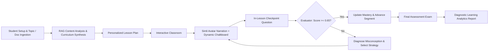
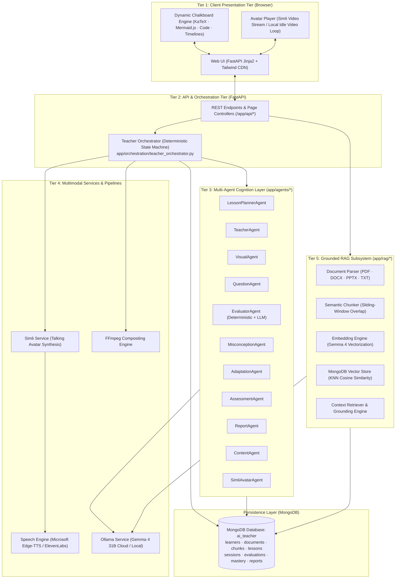
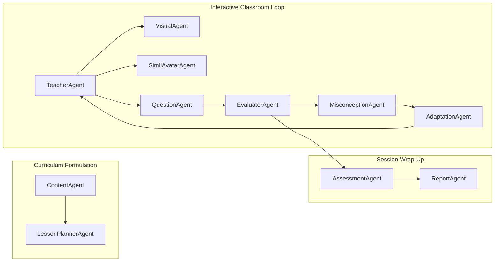

# 📘 AI Teacher — Comprehensive Project Technical Documentation
### AI Innovation Hackathon 2026 — Round 2 Technical Assessment Submission

---

## Executive Summary

This document constitutes the official technical documentation for the **AI Teacher** platform, submitted for the **AI Innovation Hackathon 2026 (Round 2 Technical Assessment)**. It provides an exhaustive, end-to-end breakdown of the system architecture, multi-agent cognitive design, grounded retrieval-augmented generation (RAG) pipeline, subject-aware visual chalkboard engine, neural voice and talking avatar synthesis, deterministic evaluation and mastery tracking, deployment procedures, and known operational characteristics.

---

## Table of Contents
1. [Problem Statement](#1-problem-statement)
2. [Solution Overview](#2-solution-overview)
3. [Key Features](#3-key-features)
4. [System Architecture](#4-system-architecture)
5. [AI/ML Models Used](#5-aiml-models-used)
6. [RAG Implementation](#6-rag-implementation)
7. [Prompt & Multi-Agent Architecture](#7-prompt--multi-agent-architecture)
8. [Personalization Approach](#8-personalization-approach)
9. [Assessment & Evaluation Methodology](#9-assessment--evaluation-methodology)
10. [Multilingual Implementation](#10-multilingual-implementation)
11. [Voice & Speech Synthesis Implementation](#11-voice--speech-synthesis-implementation)
12. [Avatar & Video Generation Approach](#12-avatar--video-generation-approach)
13. [APIs and Third-Party Services](#13-apis-and-third-party-services)
14. [Setup Instructions](#14-setup-instructions)
15. [Deployment Instructions](#15-deployment-instructions)
16. [Known Limitations & Future Roadmap](#16-known-limitations--future-roadmap)

---

## 1. Problem Statement

Traditional digital learning platforms suffer from two major architectural and pedagogical shortcomings:

1. **Passive Pre-Recorded Video Lectures**:
   - Deliver one-size-fits-all instruction without recognizing learner confusion or engagement.
   - Incapable of dynamically adapting difficulty, skipping known material, or providing alternate analogies.
   - Monologues with no interactive questioning or real-time remediation.

2. **Text-Based AI Chatbots (Reactive Q&A Engines)**:
   - Wait passively for the user to prompt them rather than proactively driving a structured learning curriculum.
   - Fail to structure lessons into progressive cognitive chunks.
   - Prone to hallucinations when explaining technical material without strict source grounding.
   - Suffer from evaluation leniency—often grading confident-sounding wrong answers as correct.

### Hackathon Challenge Mandate
The challenge requires designing and building an autonomous, human-like AI virtual educator that:
- Ingests unstructured educational content (textbooks, PDFs, notes, slides) or accepts raw subject topics.
- Structures a personalized, timed lesson plan matching learner level and available time.
- Teaches through an engaging multimodal video experience featuring a talking AI avatar, natural voice, and subject-aware visual demonstrations.
- Interacts continuously with the student through checkpoint questions.
- Identifies misconceptions and adapts its pedagogical strategy (analogies, simpler explanations, visuals, worked examples) before moving forward.
- Tracks mastery mathematically and issues actionable diagnostic reports.

---

## 2. Solution Overview

**AI Teacher** is a production-ready, full-stack educational system that transforms instruction into a **closed-loop pedagogical state machine**:

$$\text{Understand} \longrightarrow \text{Plan} \longrightarrow \text{Explain} \longrightarrow \text{Demonstrate} \longrightarrow \text{Question} \longrightarrow \text{Evaluate} \longrightarrow \text{Adapt} \longrightarrow \text{Continue}$$



### Core Architectural Decisions
- **Deterministic Orchestration**: State transitions are governed by code, not LLM whims. The LLM produces content and analyses, but `TeacherOrchestrator` determines whether the student advances.
- **Zero-Leniency Grading**: Multiple-choice questions and blank answers are graded deterministically in Python code to prevent LLM leniency. Free-text answers use strict semantic rubrics.
- **Dual-Mode Multimodal Delivery**:
  - **Live Classroom Avatar**: Generates dynamic talking-head clips for each teaching segment with an unmuted playback loop and idle state preservation.
  - **Standalone Lesson Video (`/video`)**: Synthesizes a master lesson script into a composite 1080p MP4 combining avatar, chalkboard visuals, and subtitles via FFmpeg.
- **Subject-Aware Chalkboard**: Dynamic rendering engine selecting KaTeX for mathematics, Mermaid.js for processes/biology/flowcharts, Prism.js for code, and timelines for history.

---

## 3. Key Features

| Feature Area | Technical Description | User Experience / Pedagogical Impact |
| :--- | :--- | :--- |
| **Document-Grounded RAG** | Ingestion of PDF, DOCX, PPTX, and TXT files using PyMuPDF, python-docx, and python-pptx. Semantic sliding-window chunking (500–1000 tokens, 15% overlap) indexed in MongoDB vector store. | Students can upload actual textbooks or class notes; explanations and questions cite source references directly, eliminating hallucinations. |
| **Topic-Based Synthesis** | Direct topic input (e.g., *"Quantum Computing for Beginners"*) triggers `ContentAgent` and `LessonPlannerAgent` to build full curricula without source documents. | Zero-friction exploration of any subject across science, humanities, and engineering. |
| **Dynamic Personalization** | Multi-attribute learner profiling (`level`, `language`, `teaching_style`, `available_time`, `depth`, `prior_knowledge`, `learning_objective`). | Tailors vocabulary, concept sequencing, mathematical rigor, and lesson length to the individual student. |
| **Human-Like Teaching Loop** | Closed-loop state machine enforcing: explain concept $\to$ present visual $\to$ ask checkpoint question $\to$ evaluate answer $\to$ adapt if struggling. | Replicates the cadence of an empathetic 1-on-1 private tutor. |
| **Lip-Synced AI Avatar & Voice** | Microsoft Edge-TTS neural speech synthesis combined with Simli API facial animation. | High-presence visual learning experience with synchronized lip movements. |
| **Subject-Aware Visual Engine** | Dynamic selection of chalkboard modalities: KaTeX LaTeX equations, Mermaid process diagrams, syntax-highlighted code blocks, and event timelines. | Visual demonstrations tailored to the subject (formulas for math, cycles for biology, circuits for physics). |
| **Trilingual Instruction** | Native instruction in English, Hindi, and Hinglish with seamless mid-session switching and cross-language RAG. | Accessible to regional learners; enables learning English textbooks in Hindi or Hinglish. |
| **Deterministic & Semantic Grading** | Exact-match normalization for objective questions; rubric-based semantic evaluation for open-ended questions. | Prevents flattering wrong answers; ensures authentic feedback. |
| **Misconception Diagnosis & Adaptation** | `MisconceptionAgent` identifies cognitive root causes; `AdaptationAgent` applies 1 of 5 strategies without repeating recent approaches. | When students struggle, the teacher shifts perspective (analogy, worked example, visual breakdown) rather than merely repeating itself. |
| **Recency-Weighted Mastery Tracking** | Formula-driven mastery calculation incorporating attempt scores, difficulty multipliers, and recency weighting ($w_i = 1.0 + 0.15i$). | Clear metrics tracking whether the student has mastered a concept. |
| **Diagnostic Learning Reports** | Post-session analytics dashboard: composite score, grade, concept mastery radar, diagnosed misconceptions, targeted revision recommendations, and recommended next learning path. | Actionable diagnostic feedback for both students and educators. |

---

## 4. System Architecture

The AI Teacher platform follows a decoupled, 5-tier architecture designed for reliability, modularity, and fail-soft execution.



### Component Breakdown

| Directory / File | Architectural Role | Key Responsibilities |
| :--- | :--- | :--- |
| `backend/app/main.py` | Application Entrypoint | Initializes FastAPI, mounts static assets, registers REST routers, and defines page routes. |
| `backend/app/core/` | Configuration & Logging | `config.py` uses `pydantic-settings` to parse `.env`; `logging.py` configures unified logging. |
| `backend/app/orchestration/` | State Machine Core | `teacher_orchestrator.py` manages session progression, state guards, mastery math, and avatar attachment. |
| `backend/app/agents/` | Cognitive Layer | 11 specialized pedagogical agents executing structured LLM prompts and deterministic logic. |
| `backend/app/rag/` | Knowledge Grounding | Ingestion parsers, sliding-window chunker, Ollama embeddings, and MongoDB vector search. |
| `backend/app/services/` | External Integrations | Wrappers for MongoDB (`motor`), Ollama (`httpx`), Simli API, Edge-TTS, and FFmpeg video generation. |
| `backend/app/schemas/` | Type Contracts | Pydantic v2 data models for learner profiles, lessons, sessions, questions, evaluations, and reports. |
| `backend/app/prompts/` | Prompt Engineering | Modular, role-specific prompt templates enforcing pedagogical rules, anti-leniency, and multilingual constraints. |
| `backend/app/templates/` | Dynamic UI | Jinja2 templates for setup, document analysis, lesson planning, interactive classroom, and reports. |
| `backend/app/static/` | Client Assets | CSS styles, JavaScript controllers (`classroom.js`, `app.js`), sample media, and render scripts. |

---

## 5. AI/ML Models Used

| Model / Service | Architectural Function | Deployment & Infrastructure | Rationale & Advantage |
| :--- | :--- | :--- | :--- |
| **Gemma 4 (31B Cloud / Local)** | Primary Large Language Model | Hosted locally or cloud-streamed via **Ollama** | High pedagogical reasoning capacity, structured JSON output compliance, and excellent cross-lingual capabilities (English, Hindi, Hinglish). |
| **Gemma 4 (Embedding Mode)** | Document Vector Embeddings | Vectorization endpoint via **Ollama** | Eliminates secondary embedding model overhead; unifies reasoning and semantic indexing under a single footprint. |
| **Microsoft Edge-TTS** | Primary Neural Speech Synthesis | Local edge service (`edge-tts` Python library) | Zero API cost, sub-second generation latency, and natural Indian-accented neural voices (`en-IN-NeerjaNeural`, `hi-IN-SwaraNeural`). |
| **ElevenLabs (Turbo v2)** | Premium Speech Synthesis (Optional) | Cloud API (`api.elevenlabs.io`) | Ultra-realistic voice inflection for high-fidelity demonstration videos. |
| **Simli AI** | Audio-to-Video Talking Head | Cloud API (`api.simli.ai`) | Real-time neural lip-sync from raw audio buffers, generating synchronized facial animation MP4 clips. |
| **FFmpeg Engine** | Multi-Track Video Compositor | Local binary on system PATH | Composites avatar video streams, chalkboard visual panels, and subtitle tracks into 1080p composite lesson videos. |
| **KaTeX** | Mathematical Notation Engine | Browser client CDN | Instantaneous LaTeX formula rendering without server-side image generation latency. |
| **Mermaid.js** | Algorithmic & Process Diagramming | Browser client CDN | Dynamic client-side rendering of flowcharts, state transitions, and biological cycles from markdown strings. |

---

## 6. RAG Implementation

To satisfy the assessment mandate of preventing hallucinations and grounding teaching in verified material, AI Teacher implements a 4-stage RAG pipeline:

```
[Uploaded Document: PDF / DOCX / PPTX / TXT]
                    │
                    ▼
┌────────────────────────────────────────────────────────┐
│ 1. Structural Parsing (app/rag/document_parser.py)     │
│    • PDF: PyMuPDF + pdfplumber (tables & formulas)     │
│    • DOCX: python-docx (heading styles & paragraphs)   │
│    • PPTX: python-pptx (slide titles & body text)      │
│    • TXT: UTF-8 direct character stream                │
└────────────────────────────────────────────────────────┘
                    │
                    ▼
┌────────────────────────────────────────────────────────┐
│ 2. Sliding-Window Semantic Chunking (chunker.py)       │
│    • Token window: 500–1000 tokens                     │
│    • Overlap: 15% sliding window                       │
│    • Metadata retention: Chapter, Section, Page, Source│
└────────────────────────────────────────────────────────┘
                    │
                    ▼
┌────────────────────────────────────────────────────────┐
│ 3. Vector Embeddings (embeddings.py)                   │
│    • Ingestion via Ollama embedding API                │
│    • Normalized high-dimensional float vectors         │
└────────────────────────────────────────────────────────┘
                    │
                    ▼
┌────────────────────────────────────────────────────────┐
│ 4. MongoDB KNN Cosine Vector Store (vector_store.py)   │
│    • Cosine similarity search                          │
│    • Injected into TeacherAgent & QuestionAgent prompts│
└────────────────────────────────────────────────────────┘
```

### Retrieval Grounding in Prompts
During classroom execution, `retriever.py` searches the top-$k$ most relevant chunks for the current concept. These chunks are injected into the `TeacherAgent` system prompt:

```text
GROUNDING CONTEXT FROM UPLOADED MATERIAL:
--------------------------------------------------
Source: Chapter 3, Page 42
"Ohm's law states that the current through a conductor between two points 
is directly proportional to the voltage across the two points: V = I * R."
--------------------------------------------------
RULE: Teach strictly based on the grounding context above. Do not introduce 
unverified external theories. Cite source references in 'source_refs'.
```

This guarantees that student inquiries and concept explanations remain anchored to the uploaded syllabus.

---

## 7. Prompt & Multi-Agent Architecture

AI Teacher employs **11 specialized cognitive agents** in `backend/app/agents/`. Each agent possesses dedicated Pydantic output schemas, system instructions, and few-shot examples.



### Agent Roles & Operational Profiles

1. **`ContentAgent`** (`agents/content_agent.py`):
   - Ingests parsed document chunks or raw topics.
   - Extracts subject taxonomy, fundamental concepts, prerequisite hierarchies, and difficulty ratings.
2. **`LessonPlannerAgent`** (`agents/lesson_planner_agent.py`):
   - Structures the lesson into a sequence of timed `LessonSegment` objects.
   - Adjusts segment granularity based on student time constraints (e.g., 5-minute crash course vs. 45-minute comprehensive lesson).
3. **`TeacherAgent`** (`agents/teacher_agent.py`):
   - Synthesizes two distinct outputs per segment:
     - `spoken_text`: Conversational, empathetic oral explanation for voice and avatar synthesis.
     - `board_content`: Structured chalkboard data (formulas, diagrams, bullet points, steps).
4. **`VisualAgent`** (`agents/visual_agent.py`):
   - Evaluates the subject domain and selects the optimal `BoardType` (`formula`, `steps`, `mermaid`, `code`, `timeline`, `bullets`).
5. **`QuestionAgent`** (`agents/question_agent.py`):
   - Formulates checkpoint comprehension questions at the end of each teaching segment.
   - Generates MCQs, short-answer questions, and "explain in your own words" prompts.
6. **`EvaluatorAgent`** (`agents/evaluator_agent.py`):
   - **Deterministic evaluation** for MCQs and blank answers (exact string match after normalization; 0.0 for blanks).
   - **Strict semantic evaluation** for open-ended answers with anti-leniency rules.
7. **`MisconceptionAgent`** (`agents/misconception_agent.py`):
   - Triggered when a student score falls below $0.65$.
   - Diagnoses the root cause (e.g., confusing voltage with current, inverted division in equations).
8. **`AdaptationAgent`** (`agents/adaptation_agent.py`):
   - Selects 1 of 5 remediation strategies:
     - `simpler_explanation`: Breaks the concept into elementary terms.
     - `analogy`: Uses everyday physical metaphors.
     - `visual_demonstration`: Generates a step-by-step diagram or formula breakdown.
     - `worked_example`: Solves a concrete problem step-by-step.
     - `easier_question`: Asks a scaffolding question to rebuild confidence.
   - **Anti-repetition rule**: Barred from repeating the same strategy consecutively.
9. **`AssessmentAgent`** (`agents/assessment_agent.py`):
   - Generates a comprehensive final quiz covering all lesson concepts upon curriculum completion.
10. **`ReportAgent`** (`agents/report_agent.py`):
    - Analyzes student performance across in-lesson checkpoints and final assessment.
    - Generates mastery radar charts, lists strong and weak areas, and recommends next learning steps.
11. **`SimliAvatarAgent`** (`agents/simli_avatar_agent.py`):
    - Coordinates text-to-speech rendering, Simli lip-sync generation, WebRTC signaling, and fallback video streaming.

---

## 8. Personalization Approach

Personalization is driven by the `LearnerProfile` schema, created at `/setup` and persisted in MongoDB:

```json
{
  "name": "Aarav Sharma",
  "level": "beginner",
  "language": "hinglish",
  "teaching_style": "story-based",
  "available_time": 20,
  "depth": "conceptual",
  "prior_knowledge": "Understands basic electricity and batteries, but does not know Ohm's law",
  "learning_objective": "Master Ohm's law to solve circuit physics problems"
}
```

### Parameter Impact on Agent Execution

| Profile Parameter | System Behavior & Prompt Adaptation |
| :--- | :--- |
| **Level** (`beginner`, `intermediate`, `advanced`) | **Beginner**: Relies on analogies, avoids dense math notation, defines every term.<br>**Intermediate**: Balances theory with practical equations.<br>**Advanced**: Uses formal proofs, vector calculus, edge cases, and architectural trade-offs. |
| **Language** (`english`, `hindi`, `hinglish`) | Prompts enforce instruction in the target language. Spoken narration, chalkboard text, questions, and evaluation feedback all match the selected language. |
| **Teaching Style** (`simple`, `technical`, `visual`, `story-based`) | `TeacherAgent` adopts the requested persona—using real-world narratives for *story-based*, diagrams for *visual*, and formal definitions for *technical*. |
| **Available Time** (minutes) | `LessonPlannerAgent` scales segment count. A 10-minute session generates 2 focused segments; a 45-minute session generates 5 in-depth segments with practical exercises. |
| **Prior Knowledge** | Injected into planner prompts to bypass already understood material, avoiding redundant explanations. |
| **Learning Objective** | Anchors the lesson goals; evaluation rubrics assess whether the objective was achieved. |

---

## 9. Assessment & Evaluation Methodology

The assessment engine balances **computational objectivity** with **semantic pedagogical depth**:

### 1. Zero-Leniency Deterministic Evaluation
To prevent the common LLM trap of grading confident-sounding wrong answers as correct:
- **Multiple Choice Questions (MCQs)**: Graded in pure Python code. The student's response is normalized (extracting leading letter `A/B/C/D` or matching text) and compared directly against `correct_answer`.
- **Blank Submissions**: Immediately assigned a score of `0.0` with the feedback *"No answer provided."*

### 2. Strict Semantic Rubric Evaluation
For open-ended or "explain in your own words" questions, `EvaluatorAgent` runs with strict prompt rules:
- Extracts the student's core numeric or conceptual conclusion first.
- Checks conclusion against known ground truth.
- A polite or authoritative tone never compensates for missing or inverted facts.

### 3. Mathematical Mastery Tracking
Concept mastery ($M$) is calculated deterministically:

$$M = \min\left(1.0, \max\left(0.0, \frac{\sum_{i=0}^{n-1} s_i \cdot w_i \cdot d_i}{\sum_{i=0}^{n-1} w_i}\right)\right)$$

Where:
- $s_i \in [0.0, 1.0]$: Student score on attempt $i$.
- $w_i = 1.0 + (i \times 0.15)$: Recency weight factor (recent answers carry higher significance).
- $d_i$: Difficulty multiplier (`easy` = 0.8, `medium` = 1.0, `hard` = 1.3).
- **Mastery Threshold**: $M \ge 0.65$ required to proceed. Scores below $0.65$ trigger `MisconceptionAgent` and `AdaptationAgent`.

### 4. Accurate Diagnostic Reporting
- Composite score and grade are calculated across **all** attempted questions.
- If the final assessment has not yet been taken, the report displays `null` / `"Not assessed"` rather than an incorrect $0\%$ or $F$ grade.

---

## 10. Multilingual Implementation

AI Teacher supports **English, Hindi, and Hinglish** (conversational Hindi-English blend):

```
Student Inquiry / Setup (English / Hindi / Hinglish)
                      │
                      ▼
┌────────────────────────────────────────────────────────┐
│ Prompt Constraint Injection                            │
│ "Respond entirely in {language}. Retain technical      │
│ terms in English script if language is Hinglish."      │
└────────────────────────────────────────────────────────┘
                      │
                      ▼
┌────────────────────────────────────────────────────────┐
│ Speech Synthesis Matching                              │
│ • English / Hinglish: en-IN-NeerjaNeural               │
│ • Hindi: hi-IN-SwaraNeural                             │
└────────────────────────────────────────────────────────┘
```

### Key Multilingual Capabilities
1. **Dynamic Mid-Session Switching**: Students can switch languages mid-lesson via `POST /api/sessions/{session_id}/switch-language`. The orchestrator maintains session history, current segment index, and mastery scores without restarting.
2. **Cross-Language RAG**: The system can ingest an English textbook or research paper and deliver spoken narration and visual board explanations in Hindi or Hinglish.
3. **Natural Hinglish Generation**: The LLM naturally explains concepts in colloquial Hinglish (e.g., *"Current directly proportional hota hai voltage ke, agar resistance constant rahe"*), bridging accessibility barriers for Indian students.

---

## 11. Voice & Speech Synthesis Implementation

### Architecture & Pipeline
Audio narration is generated dynamically for every teaching segment, question, reteaching loop, and student inquiry:

```
TeacherOutput.spoken_text
           │
           ▼
┌────────────────────────────────────────────────────────┐
│ Edge-TTS Synthesizer (app/services/simli_service.py)   │
│ • Voice: en-IN-NeerjaNeural / hi-IN-SwaraNeural        │
│ • Audio Format: MP3 24kHz audio buffer                 │
└────────────────────────────────────────────────────────┘
           │
           ▼
┌────────────────────────────────────────────────────────┐
│ Audio Buffer Streamed to Simli API                     │
│ • Lip-sync alignment and video clip generation         │
└────────────────────────────────────────────────────────┘
```

### Features & Fallbacks
- **Default Engine**: Microsoft Edge-TTS is zero-cost, requires no external API keys, and generates audio with sub-second latency.
- **Optional Premium TTS**: ElevenLabs integration (`TTS_PROVIDER=elevenlabs`) is supported for studio-quality voice generation when `ELEVENLABS_API_KEY` is provided.
- **Fail-Soft Timeout Guard**: Audio generation is protected by a 25-second timeout. If the voice engine or network fails, the system logs the issue and falls back to text-only mode with an idle video loop, preventing classroom crashes.

---

## 12. Avatar & Video Generation Approach

The platform provides a dual-mode video architecture:

### 1. Interactive Classroom Live Avatar
- Synchronized with each teaching segment.
- `_attach_avatar()` in `teacher_orchestrator.py` takes the teacher's `spoken_text`, generates audio via Edge-TTS, and calls `simli_service.create_text_to_video_stream()`.
- Simli returns a lip-synced video clip URL (`/static/generated_videos/<id>.mp4`).
- Frontend `classroom.js` swaps the looping idle avatar video (`simli_sample.mp4`) with the newly generated speaking clip, playing audio unmuted.
- When the video finishes, the player smoothly transitions back to the idle loop.

### 2. Standalone Topic Video Generator (`/video`)
For pre-rendered video lessons:
1. User enters a topic, target level, language, and duration.
2. `LessonScriptService` uses Gemma 4 to draft a timed educational script.
3. Edge-TTS synthesizes the voice track.
4. Simli renders the talking avatar head.
5. **FFmpeg Compositor** merges the visual elements into a side-by-side layout:
   - **Left Panel (40%)**: Simli talking avatar.
   - **Right Panel (60%)**: Dynamic chalkboard visuals (KaTeX math, diagrams, key takeaways).
   - **Bottom Overlay**: Synchronized subtitle captions.
6. The resulting MP4 is saved to `backend/app/static/generated_videos/` and made available for streaming or download.

---

## 13. APIs and Third-Party Services

### REST API Endpoints

#### Document Ingestion & Curricula
- `POST /api/documents/upload` — Uploads and vectorizes PDF, DOCX, PPTX, or TXT documents.
- `POST /api/topics/analyze` — Synthesizes learning concepts directly from a topic prompt.
- `POST /api/lessons/plan` — Generates an ordered, timed lesson plan.
- `GET /api/lessons/{lesson_id}` — Retrieves lesson details and segments.

#### Interactive Classroom & Orchestrator
- `POST /api/sessions/start` — Initializes a teaching session for a learner and lesson.
- `POST /api/sessions/{session_id}/advance` — Delivers the current concept segment, visual board, and checkpoint question.
- `POST /api/sessions/{session_id}/answer` — Evaluates student answer, updates mastery, and triggers adaptation if needed.
- `POST /api/sessions/{session_id}/ask` — Processes student questions and returns structured chalkboard steps and spoken voice.
- `POST /api/sessions/{session_id}/simplify` — Re-explains the current concept using low-complexity pedagogy.
- `POST /api/sessions/{session_id}/switch-language` — Switches the teaching language mid-session.

#### Assessments, Reports & Media
- `GET /api/assessments/{lesson_id}` — Generates the end-of-lesson quiz.
- `POST /api/assessments/{lesson_id}/submit` — Grades final exam submissions.
- `GET /api/reports/{session_id}` — Generates diagnostic learning reports with mastery radar data.
- `POST /api/avatar/simli-topic-video` — Generates a standalone composited MP4 video lesson.

### External Dependencies & Services
- **Ollama**: Local host for `gemma4:31b-cloud` (reasoning and embeddings).
- **MongoDB**: Persistent database (`motor` async driver).
- **Simli API**: Neural lip-synced talking avatar streaming.
- **Edge-TTS / ElevenLabs**: Speech synthesis engines.
- **FFmpeg**: Video encoding and side-by-side compositing.
- **CDN Libraries**: KaTeX (math), Mermaid.js (diagrams), Prism.js (code syntax), Tailwind CSS.

---

## 14. Setup Instructions

### System Prerequisites
- **Operating System**: Windows 10/11, macOS, or Ubuntu 20.04+
- **Python**: Version 3.10, 3.11, or 3.12
- **MongoDB**: Local MongoDB community server (`mongodb://localhost:27017`) or MongoDB Atlas
- **Ollama**: Installed and running locally
- **FFmpeg**: (Optional) Installed on system PATH for `/video` compositing

### Step-by-Step Installation

```powershell
# 1. Clone the repository
git clone https://github.com/Gunjan-Bansal1/Innovation-AI-Teacher.git
cd Innovation-AI-Teacher

# 2. Create and activate a Python virtual environment
python -m venv .venv
# On Windows:
.\.venv\Scripts\Activate.ps1
# On Linux/macOS:
source .venv/bin/activate

# 3. Install required Python packages
pip install -r requirements.txt

# 4. Create your local environment configuration
copy .env.example .env

# 5. Pull the required Gemma model in Ollama
ollama pull gemma4:31b-cloud
```

### Environment Configuration (`.env`)
Edit `.env` with your preferred settings:

```ini
MONGODB_URI=mongodb://localhost:27017
MONGODB_DATABASE=ai_teacher

OLLAMA_BASE_URL=http://localhost:11434
OLLAMA_MODEL=gemma4:31b-cloud
EMBEDDING_MODEL=gemma4:31b-cloud

TTS_PROVIDER=edge-tts
EDGE_TTS_VOICE=en-IN-NeerjaNeural

# Optional: Add your Simli API key for real-time lip-synced avatar streaming
SIMLI_API_KEY=your_simli_api_key_here
SIMLI_FACE_ID=cace3ef7-a4c4-425d-a8cf-a5358eb0c427
```

---

## 15. Deployment Instructions

### One-Command Quickstart (Windows)
The repository includes an automated PowerShell orchestrator that verifies dependencies, starts MongoDB and Ollama if stopped, runs the FastAPI backend, and launches your browser:

```powershell
.\run_ai_teacher.bat
# Or directly via PowerShell:
powershell -ExecutionPolicy Bypass -File .\start_ai_teacher.ps1
```

To shut down all background processes cleanly:
```powershell
.\stop_ai_teacher.bat
```

### Manual Production Launch (Any Platform)
```bash
# Activate virtual environment
source .venv/bin/activate  # or .\.venv\Scripts\Activate.ps1

# Start the uvicorn web server
cd backend
python -m uvicorn app.main:app --host 0.0.0.0 --port 8000 --workers 4
```
Access the application at `http://localhost:8000`.

---

## 16. Known Limitations & Future Roadmap

| Area | Current Behavior | Planned Improvement |
| :--- | :--- | :--- |
| **Avatar Latency** | Classroom avatar generation runs synchronously in-request (taking 15–25s per segment when Simli is active). | Implement background task generation with WebSocket/SSE status polling for instant UI transitions. |
| **Language Coverage** | Native support for English, Hindi, and Hinglish. | Add support for additional Indian regional languages (Tamil, Telugu, Bengali, Marathi) and international languages (Spanish, French). |
| **Client-Side CDN Dependencies** | KaTeX, Mermaid.js, and Tailwind CSS load via CDN. | Bundle asset scripts locally into `/static/vendor/` to allow completely air-gapped offline classroom deployments. |
| **Realtime WebRTC Audio** | Speech input uses browser Web Speech API transcription. | Complete full duplex LiveKit audio streaming with sub-500ms voice turn-taking. |

---

<div align="center">

**AI Teacher — AI Innovation Hackathon 2026**  
*Submitted with pride by the AI Teacher Development Team.*

</div>
