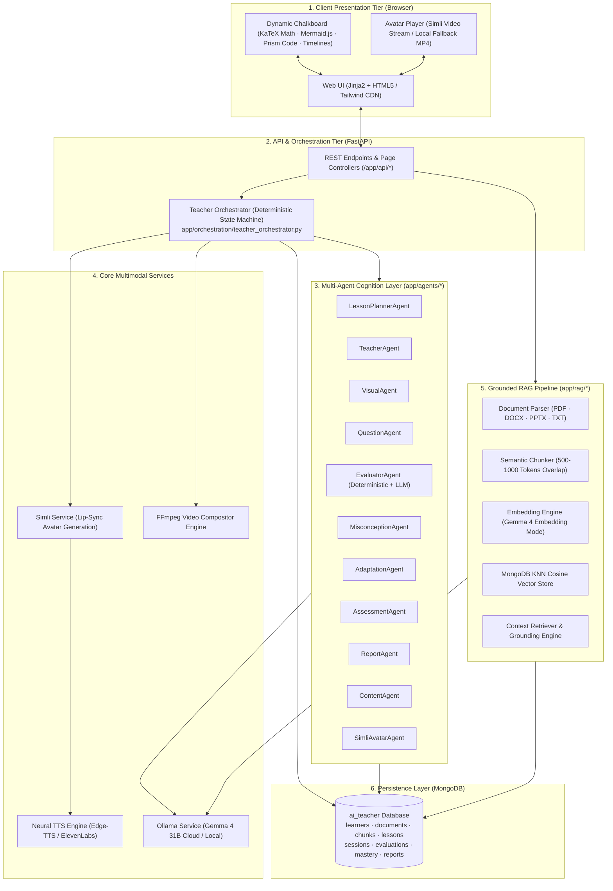
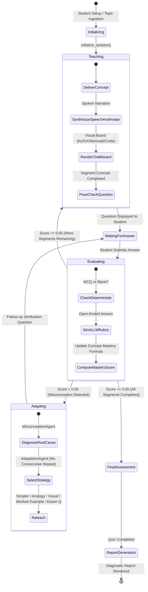

# 🎓 AI Teacher — Human-Like Adaptive AI Educator

<div align="center">

[](https://www.python.org/)
[](https://fastapi.tiangolo.com/)
[--Cloud-orange.svg?logo=google&logoColor=white)](https://ollama.com/)
[](https://www.mongodb.com/)
[](https://www.simli.com/)
[](https://github.com/rany2/edge-tts)
[](#round-2-technical-assessment-compliance)

**Autonomous, Multimodal, 1-on-1 Virtual Educator Powered by Multi-Agent Cognition, Grounded RAG, and Lip-Synced Video Synthesis**

[Problem Statement](#problem-statement) • [Key Features](#key-features) • [System Architecture](#system-architecture) • [Pedagogical State Machine](#pedagogical-state-machine) • [RAG Pipeline](#rag-pipeline) • [Multi-Agent System](#multi-agent-system) • [Visual & Video Engine](#visual--video-engine) • [Quickstart](#quickstart--setup) • [Demo Flow](#demo-flow-walkthrough) • [API Reference](#api-reference)

---

</div>

## 📌 Problem Statement

Traditional digital learning platforms suffer from fundamental pedagogical limitations:
1. **Pre-recorded video lectures** are passive monologues—incapable of sensing confusion, answering spontaneous questions, or adapting difficulty.
2. **Text-based AI chatbots** act as passive answer engines—they wait for user prompts rather than proactively guiding a learner through structured learning objectives.

### The Challenge
As specified in the **Round 2 Technical Assessment (AI Innovation Hackathon 2026)**:
> *"Design and develop an AI-powered virtual teacher capable of understanding learning material, creating personalized lessons, and teaching students through an AI-generated video experience... The system should not function as a basic question-answer chatbot. It should demonstrate the behavior of a real teacher by understanding the learner, planning the lesson, explaining concepts, providing examples, asking questions, evaluating responses, identifying misconceptions, and adapting the teaching approach."*

### Our Solution
**AI Teacher** is a full-stack, multimodal educational platform. It treats teaching not as a generation task, but as a **closed-loop pedagogical state machine**:
$$\text{Understand} \longrightarrow \text{Plan} \longrightarrow \text{Explain} \longrightarrow \text{Demonstrate} \longrightarrow \text{Question} \longrightarrow \text{Evaluate} \longrightarrow \text{Adapt} \longrightarrow \text{Continue}$$

---

## 🌟 Key Features

| Feature | Assessment Req. | Implementation Details |
| :--- | :---: | :--- |
| **Document-Grounded Learning** | §3, §17.1 | Ingestion of **PDF, DOCX, PPTX, and TXT** documents via PyMuPDF, python-docx, and python-pptx with sliding-window semantic chunking and MongoDB vector KNN search. |
| **Topic-Based Teaching** | §4, §17.2 | Instant curriculum synthesis for any prompt (e.g. *"Explain Newton's Laws to Class 8"* or *"React for technical interviews"*) without requiring source documents. |
| **Personalized Curricula** | §6, §7, §17.3-4 | Adapts dynamically to learner **level** (`beginner`, `intermediate`, `advanced`), **available time** (5m, 20m, 60m, multi-day), **teaching style** (`simple`, `technical`, `visual`, `story-based`), and **prior knowledge**. |
| **Human-Like Teaching Loop** | §5, §11, §17.5 | Deterministic `TeacherOrchestrator` state machine enforcing progressive concept chunking, interactive checkpoints, and mastery verification before advancing. |
| **Talking AI Avatar & Voice** | §9, §17.6-8 | Real-time audio-driven lip-sync avatar generated via **Simli API**, backed by **Microsoft Edge-TTS** neural voices (`en-IN-NeerjaNeural`, `hi-IN-SwaraNeural`) with ElevenLabs premium support and local FFmpeg fallback. |
| **Subject-Aware Dynamic Visuals** | §10 | Context-sensitive visual chalkboard rendering: **KaTeX** LaTeX math, **Mermaid.js** flowcharts & biological cycles, syntax-highlighted code blocks, and chronological timelines. |
| **Multilingual Mastery** | §8, §17.9 | Full native instruction in **English, Hindi, and Hinglish** with mid-session seamless language switching and cross-language RAG (e.g., English textbook $\to$ Hindi spoken lecture). |
| **Objective & Semantic Evaluation** | §12, §17.10 | **Deterministic zero-leniency grading** for MCQs & blank submissions; strict semantic rubric LLM grading for conceptual and open-ended student responses. |
| **Misconception Diagnosis & Adaptation** | §12, §17.11 | Diagnoses exact misunderstanding root causes and triggers 1 of 5 targeted pedagogical interventions (`simpler explanation`, `analogy`, `visual demonstration`, `worked example`, `easier question`) with anti-repetition safeguards. |
| **Recency-Weighted Mastery Tracking**| §13, §14 | Mathematical mastery formulation scaling attempt scores by recency weights ($w_i = 1.0 + 0.15i$) and question difficulty ($d_i \in [0.8, 1.3]$). |
| **Diagnostic Learning Reports** | §13, §14 | Post-session analytics dashboard: composite score, grade, concept mastery radar, diagnosed misconceptions, targeted revision recommendations, and recommended next learning path. |
| **Production-Ready Prototype** | §17.12 | Modular FastAPI backend, Jinja2 dynamic UI, single-command launcher, health-check suites, and full test coverage. |

---

## 🏗️ System Architecture

AI Teacher operates across five decoupled tiers: **Client Presentation**, **API & Orchestration**, **Multi-Agent Cognition**, **Grounded RAG Pipeline**, and **Persistence**.



---

## 🔄 Pedagogical State Machine

The **Teacher Orchestrator** (`backend/app/orchestration/teacher_orchestrator.py`) guarantees pedagogical rigor. Unlike conversational chatbots where the LLM controls the dialogue flow, in AI Teacher **the LLM is never permitted to mutate session state directly**. State transitions are deterministic and guarded by mastery thresholds:



### Deterministic Mastery Calculation
Concept mastery is computed mathematically without LLM hallucination:
$$M = \min\left(1.0, \max\left(0.0, \frac{\sum_{i=0}^{n-1} s_i \cdot w_i \cdot d_i}{\sum_{i=0}^{n-1} w_i}\right)\right)$$
Where:
- $s_i \in [0.0, 1.0]$: student's attempt score.
- $w_i = 1.0 + (i \times 0.15)$: recency weight (recent attempts carry higher weight).
- $d_i$: question difficulty coefficient (`easy`: 0.8, `medium`: 1.0, `hard`: 1.3).
- **Mastery Threshold**: $M \ge 0.65$ required to advance to the next segment.

---

## 📚 Grounded RAG Pipeline

To prevent hallucination in textbook-based teaching, the RAG subsystem (`backend/app/rag/`) enforces verifiable source grounding:

```
[Uploaded Document: PDF / DOCX / PPTX / TXT]
                    │
                    ▼
┌───────────────────────────────────────────────┐
│ 1. Ingestion & Structural Parsing             │
│    • PyMuPDF / pdfplumber: tables, formulas   │
│    • python-docx / python-pptx: hierarchy     │
└───────────────────────────────────────────────┘
                    │
                    ▼
┌───────────────────────────────────────────────┐
│ 2. Sliding-Window Semantic Chunking           │
│    • 500–1000 tokens with 15% overlap         │
│    • Metadata preservation (Chapter, Page)    │
└───────────────────────────────────────────────┘
                    │
                    ▼
┌───────────────────────────────────────────────┐
│ 3. Vectorization & Indexing                   │
│    • Ollama: gemma4:31b-cloud (embedding mode)│
│    • Unified single-model deployment          │
└───────────────────────────────────────────────┘
                    │
                    ▼
┌───────────────────────────────────────────────┐
│ 4. MongoDB KNN Vector Store                   │
│    • Cosine similarity search                 │
│    • Injected into TeacherAgent prompts       │
└───────────────────────────────────────────────┘
```

---

## 🤖 Multi-Agent Cognition Layer

AI Teacher utilizes 11 specialized pedagogical agents located in `backend/app/agents/`:

| Agent | Source File | Prompt Location | Pedagogical Responsibility |
| :--- | :--- | :--- | :--- |
| **ContentAgent** | `content_agent.py` | Built-in | Parses raw document corpora, extracts taxonomy, key concepts, prerequisites, and difficulty. |
| **LessonPlannerAgent**| `lesson_planner_agent.py` | `prompts/lesson_planner.py` | Structures lessons into sequenced segments according to time budget and learner level. |
| **TeacherAgent** | `teacher_agent.py` | `prompts/system_teacher.py`<br>`prompts/teaching.py` | Crafts conversational spoken narration + structured board content per segment. |
| **VisualAgent** | `visual_agent.py` | Built-in | Selects optimal visual modality (`formula`, `mermaid`, `code`, `timeline`, `steps`, `table`). |
| **QuestionAgent** | `question_agent.py` | `prompts/question_generator.py` | Generates diagnostic MCQs, conceptual problems, and "explain in your own words" checks. |
| **EvaluatorAgent** | `evaluator_agent.py` | `prompts/evaluator.py` | Zero-leniency deterministic MCQ evaluation + rubric-based semantic grading for free text. |
| **MisconceptionAgent**| `misconception_agent.py`| `prompts/misconception.py` | Analyzes wrong answers to classify failure modes (factual, conceptual, procedural). |
| **AdaptationAgent** | `adaptation_agent.py` | Built-in | Selects 1 of 5 remediation strategies without repeating recent approaches. |
| **AssessmentAgent** | `assessment_agent.py` | `prompts/assessment.py` | Generates comprehensive final exam and evaluates overall subject retention. |
| **ReportAgent** | `report_agent.py` | Built-in | Synthesizes performance data into actionable diagnostic learning reports. |
| **SimliAvatarAgent** | `simli_avatar_agent.py`| Built-in | Coordinates audio streaming, WebRTC sessions, and lip-sync video generation. |

---

## 🎨 Subject-Aware Visuals & Video Engine

### 1. Dynamic Chalkboard Rendering
The classroom UI inspects the agent's chosen `BoardType` and renders high-fidelity visual representations client-side:

| Subject | Modality (`BoardType`) | Technology | Demonstration |
| :--- | :--- | :--- | :--- |
| **Mathematics** | `formula`, `steps` | **KaTeX** | Real-time LaTeX equations: $E = mc^2$, step-by-step calculus derivations. |
| **Physics / Engineering** | `mermaid`, `formula` | **Mermaid.js** + KaTeX | Circuit diagrams, state machines, force interaction flowcharts. |
| **Biology / Medicine** | `mermaid`, `bullets` | **Mermaid.js** | Cell respiration cycles, anatomical hierarchies, food webs. |
| **Computer Science** | `code`, `mermaid` | **Prism.js** / KaTeX | Syntax-highlighted algorithms, ASTs, execution flowcharts. |
| **History / Social Studies** | `timeline`, `table` | **HTML5** / Markdown | Chronological timelines, comparison tables of historical events. |

### 2. Dual-Mode Video Generation Pipeline
1. **Interactive Classroom Live Avatar**:
   - Each `TeacherOutput` contains `spoken_text`.
   - `_attach_avatar()` in `teacher_orchestrator.py` converts text to neural speech using **Edge-TTS** (or ElevenLabs) and calls **Simli API** to generate a lip-synced video clip.
   - Frontend `classroom.js` seamlessly swaps an idle breathing loop to the active teacher clip with zero UI stutter.
   - *Fail-soft design*: 25s timeout safeguard; falls back automatically to local video loop if API keys are absent.
2. **Standalone Topic Video Generator (`/video`)**:
   - Creates full-length MP4 video lessons from any topic.
   - Gemma generates the master script $\to$ Edge-TTS synthesizes audio $\to$ Simli generates lip-sync $\to$ **FFmpeg compositor** merges avatar, chalkboard visual panel, and subtitles side-by-side into a single 1080p MP4.

---

## ⚡ Quickstart & Setup

### System Prerequisites
- **OS**: Windows 10/11, Linux, or macOS
- **Python**: 3.10 or higher
- **Database**: MongoDB (local instance on `mongodb://localhost:27017` or MongoDB Atlas URI)
- **Ollama**: Installed locally with `gemma4:31b-cloud` model pulled
- **FFmpeg**: (Optional) Installed on PATH for standalone `/video` compositing

### 1. One-Command Launch (Windows Recommended)
The project includes automated launcher scripts that verify environment variables, start MongoDB and Ollama services, run FastAPI, and open your default browser:

```powershell
# Double-click or execute from PowerShell:
.\run_ai_teacher.bat

# Or launch directly with PowerShell:
powershell -ExecutionPolicy Bypass -File .\start_ai_teacher.ps1
```

To stop all background services cleanly:
```powershell
.\stop_ai_teacher.bat
```

---

### 2. Manual Step-by-Step Setup

#### Step A: Clone & Setup Environment
```bash
# Clone the repository
git clone https://github.com/your-org/ai-teacher.git
cd ai-teacher

# Create virtual environment
python -m venv .venv

# Activate virtual environment
# On Windows:
.\.venv\Scripts\Activate.ps1
# On Linux/macOS:
source .venv/bin/activate

# Install dependencies
pip install -r requirements.txt
```

#### Step B: Configure `.env`
Copy `.env.example` to `.env`:
```bash
copy .env.example .env
```
Populate the configuration values:
```ini
# Core Storage & LLM
MONGODB_URI=mongodb://localhost:27017
MONGODB_DATABASE=ai_teacher
OLLAMA_BASE_URL=http://localhost:11434
OLLAMA_MODEL=gemma4:31b-cloud
EMBEDDING_MODEL=gemma4:31b-cloud

# Speech Synthesis (Edge-TTS is free and built-in)
TTS_PROVIDER=edge-tts
EDGE_TTS_VOICE=en-IN-NeerjaNeural
# Optional ElevenLabs:
ELEVENLABS_API_KEY=

# Talking Avatar (Simli API)
SIMLI_API_KEY=your_simli_api_key_here
SIMLI_FACE_ID=cace3ef7-a4c4-425d-a8cf-a5358eb0c427

# Optional LiveKit WebRTC Session
LIVEKIT_URL=
LIVEKIT_API_KEY=
LIVEKIT_API_SECRET=
```

#### Step C: Pull Local AI Model
```bash
ollama pull gemma4:31b-cloud
```

#### Step D: Run the FastAPI Server
```bash
cd backend
python -m uvicorn app.main:app --reload --host 127.0.0.1 --port 8000
```
Open **`http://127.0.0.1:8000`** in your browser.

---

## 🎬 Demo Flow Walkthrough

Follow this standard 3–7 minute journey for evaluations and demonstrations:

```
[1. Portal (/)] ──> [2. Learner Setup (/setup)] ──> [3. Upload / Topic (/analyze)]
                                                               │
                                                               ▼
[6. Learning Report (/report)] <── [5. Interactive Classroom (/classroom)] <── [4. Lesson Plan (/lesson-plan)]
```

1. **Learner Setup (`/setup`)**:
   - Create profile: Select **Level** (*Beginner*), **Language** (*English* / *Hindi* / *Hinglish*), **Teaching Style** (*Simple*), **Time** (*20 mins*), and enter **Prior Knowledge**.
2. **Content Ingestion (`/analyze`)**:
   - **Path A (RAG)**: Upload a PDF/DOCX/PPTX notes file. The system parses headings, formulas, and builds vector embeddings.
   - **Path B (Topic)**: Enter a topic directly (e.g., *"Photosynthesis"* or *"Ohm's Law"*).
3. **Curriculum Review (`/lesson-plan`)**:
   - Inspect the AI-generated structured segments, durations, and core learning objectives.
4. **Interactive AI Classroom (`/classroom`)**:
   - **Spoken Teaching**: Simli avatar speaks the lesson explanation with natural Edge-TTS voice.
   - **Dynamic Board**: Chalkboard updates with KaTeX math, Mermaid diagrams, or code.
   - **Checkpoint Question**: AI Teacher pauses and asks a comprehension question.
   - **Misconception & Adaptation**: Intentionally submit an incorrect answer. Observe the teacher diagnose the misconception and dynamically switch strategies (e.g. providing an analogy or visual breakdown).
   - **Ask Teacher**: Click "Ask Teacher" to ask a spontaneous question; receive a structured board breakdown and spoken answer.
   - **Language Switch**: Switch mid-lesson to *Hindi* or *Hinglish* and observe continuity.
5. **Final Assessment (`/assessment`) & Report (`/report`)**:
   - Complete the quiz. Review the comprehensive diagnostic report showing accuracy percentage, mastery radar, diagnosed misconceptions, and recommended next topics.
6. **Standalone Topic Video Generator (`/video`)**:
   - Enter a topic, choose duration (e.g., 60 seconds), click **Generate Simli Video**, and download/stream the composited MP4.

---

## 📡 API Reference

The backend provides full REST coverage for headless and frontend integration:

### Ingestion & Curricula
- `POST /api/documents/upload` — Ingest and vectorize PDF, DOCX, PPTX, or TXT documents.
- `POST /api/topics/analyze` — Synthesize curriculum concepts from a direct topic string.
- `POST /api/lessons/plan` — Generate a timed, personalized multi-segment lesson plan.
- `GET /api/lessons/{lesson_id}` — Retrieve lesson plan metadata and segments.

### Classroom & Orchestration
- `POST /api/sessions/start` — Initialize a new teaching session for a learner and lesson.
- `POST /api/sessions/{session_id}/advance` — Deliver current segment explanation, visual board, and checkpoint question.
- `POST /api/sessions/{session_id}/answer` — Submit student response; triggers deterministic grading, misconception analysis, and adaptation.
- `POST /api/sessions/{session_id}/ask` — Student spontaneous inquiry; returns structured board steps and spoken audio.
- `POST /api/sessions/{session_id}/simplify` — Reteach current concept using alternative low-complexity pedagogy.
- `POST /api/sessions/{session_id}/switch-language` — Change teaching language (`english`, `hindi`, `hinglish`) dynamically.

### Assessment, Reports & Avatar
- `GET /api/assessments/{lesson_id}` — Generate final comprehensive quiz.
- `POST /api/assessments/{lesson_id}/submit` — Submit final quiz answers and compute retention.
- `GET /api/reports/{session_id}` — Retrieve diagnostic learning analytics and mastery radar.
- `POST /api/avatar/lesson-video` — Generate composited video for an entire lesson plan.
- `POST /api/avatar/simli-topic-video` — Generate standalone topic video (Gemma script + Edge-TTS + Simli + FFmpeg).

---

## 🏆 Round 2 Technical Assessment Compliance

This project satisfies all requirements outlined in the **AI Innovation Hackathon 2026 Round 2 Technical Assessment**:

| Assessment Section | Specification | AI Teacher Implementation | Status |
| :--- | :--- | :--- | :---: |
| **§17.1** | Learning from uploaded material | `app/rag/` — Multi-format parser (PDF, DOCX, PPTX, TXT) + sliding semantic chunker + MongoDB vector store | ✅ **Complete** |
| **§17.2** | Topic-based teaching | `/api/topics/analyze` + `LessonPlannerAgent` generates full curricula without documents | ✅ **Complete** |
| **§17.3** | AI-generated lesson structure | `LessonPlannerAgent` produces timed, ordered concept segments tailored to timeframe | ✅ **Complete** |
| **§17.4** | Personalized teaching | Learner profile (level, language, style, time, depth, prior knowledge) steers all prompts | ✅ **Complete** |
| **§17.5** | Human-like teaching interaction | Deterministic state machine enforces: understand $\to$ plan $\to$ explain $\to$ demonstrate $\to$ question $\to$ evaluate $\to$ adapt | ✅ **Complete** |
| **§17.6** | Video-based AI Teacher presentation| `/video` FFmpeg video compositor + classroom dynamic avatar attachment | ✅ **Complete** |
| **§17.7** | AI voice | Microsoft Edge-TTS neural speech (`en-IN-NeerjaNeural`, `hi-IN-SwaraNeural`) + ElevenLabs support | ✅ **Complete** |
| **§17.8** | Human-like AI avatar | Simli lip-synced talking head with facial animation matched to spoken narration | ✅ **Complete** |
| **§17.9** | Multilingual capability | Native English, Hindi, and Hinglish instruction with mid-session switching and cross-language RAG | ✅ **Complete** |
| **§17.10** | Student questioning & assessment | Diagnostic checkpoint questions, MCQ/short-answer, final quiz, and detailed rubric scoring | ✅ **Complete** |
| **§17.11** | Adaptive response to performance | `MisconceptionAgent` root cause classification + 5 `AdaptationAgent` teaching strategies | ✅ **Complete** |
| **§17.12** | Working prototype | Full FastAPI web application accessible at `http://127.0.0.1:8000` | ✅ **Complete** |

---

## 🛡️ Architectural Invariants & Fail-Soft Design

1. **State Machine Independence**: The LLM *never* mutates session state directly. State transitions are strictly validated and recorded by `TeacherOrchestrator`.
2. **Zero-Leniency Grading**: Objective questions (MCQs, blank answers) are graded deterministically in Python code—preventing LLM hallucination and leniency. Open-ended questions apply strict extraction rubrics.
3. **Anti-Repetition Interventions**: `last_strategy_used` is tracked persistently; the adaptation engine is barred from repeating the same pedagogical strategy consecutively.
4. **Fail-Soft Multimodal Resilience**: Network calls to Simli and TTS are guarded by strict 25-second timeouts and fallback mechanisms. If third-party APIs are unavailable, the classroom falls back to local video loops without crashing.
5. **Accurate Reporting Scope**: Accuracy percentages reflect the combined pool of verified answers, returning `null` / "Not assessed" if the final assessment was not taken, avoiding misleading 0% metrics.
6. **Strict Credential Protection**: `.env.example` contains sanitized placeholders only. API keys and sensitive tokens are strictly excluded from version control.

---

## 📂 Project Structure

```
ai-teacher/
├── backend/
│   └── app/
│       ├── agents/              # 11 Specialized Cognitive Agents
│       │   ├── adaptation_agent.py
│       │   ├── assessment_agent.py
│       │   ├── content_agent.py
│       │   ├── evaluator_agent.py
│       │   ├── lesson_planner_agent.py
│       │   ├── misconception_agent.py
│       │   ├── question_agent.py
│       │   ├── report_agent.py
│       │   ├── simli_avatar_agent.py
│       │   ├── teacher_agent.py
│       │   └── visual_agent.py
│       ├── api/                 # FastAPI REST Endpoints & Routers
│       │   ├── assessments.py
│       │   ├── avatar.py
│       │   ├── documents.py
│       │   ├── health.py
│       │   ├── learners.py
│       │   ├── lessons.py
│       │   ├── sessions.py
│       │   ├── students_reports.py
│       │   └── topics.py
│       ├── core/                # Configuration, Logging, and Settings
│       ├── orchestration/       # Deterministic Teacher Orchestrator
│       │   └── teacher_orchestrator.py
│       ├── prompts/             # Prompt Engineering Templates
│       ├── rag/                 # Parser, Semantic Chunker, Vector Store, Retriever
│       ├── schemas/             # Pydantic Contracts and Enums
│       ├── services/            # MongoDB, Ollama, Simli, TTS, Video Compositor
│       ├── static/              # CSS, JS, Chalkboard Renderers, Sample Media
│       └── templates/           # Jinja2 HTML5 Templates
├── docs/                        # Architecture Documentation & Manuals
├── tests/                       # Automated Pytest Suite & Health Checks
├── .env.example                 # Configuration Template
├── requirements.txt             # Python Dependencies
├── run_ai_teacher.bat           # One-Click Launch Script
├── start_ai_teacher.ps1         # Full PowerShell Dependency & Service Orchestrator
├── stop_ai_teacher.bat          # Service Teardown Script
└── stop_ai_teacher.ps1          # PowerShell Teardown Script
```

---

## 🧪 Testing & Verification

Run the test suite to verify system health and deterministic evaluation logic:

```powershell
# Run all unit and integration tests:
pytest -v

# Run health check endpoints:
pytest tests/test_health.py -v

# Run end-to-end flow verification:
pytest tests/test_e2e_flow.py -v
```

---

<div align="center">

**Built for the AI Innovation Hackathon 2026 — Round 2 Technical Assessment**  
*Empowering learners worldwide through adaptive, human-like AI education.*

</div>
