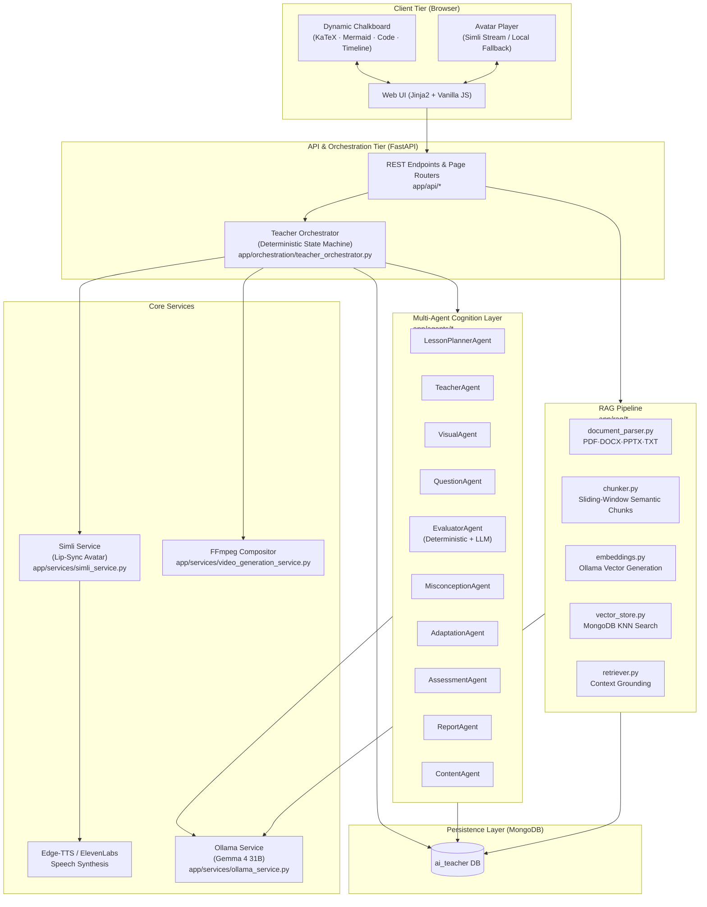
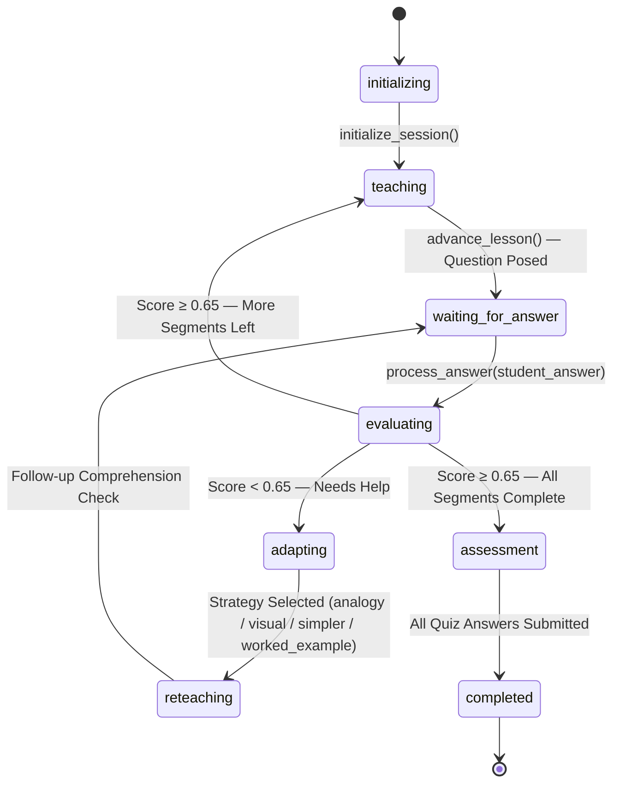

# 🧠 AI Teacher — System Brain & Architecture Blueprint
### Round 2 Technical Assessment — AI Innovation Hackathon 2026

> **Challenge**: Build a Human-Like AI Educator That Teaches Through Video  
> **Core LLM**: Gemma 4 (31B Cloud / Local via Ollama)  
> **Backend**: FastAPI (Python 3.10+) | **DB & Vector Store**: MongoDB | **Frontend**: Jinja2 + Vanilla JS + Tailwind CDN + KaTeX + Mermaid.js  
> **Voice & Avatar**: Simli (Lip-Sync Talking Head) + Edge-TTS / ElevenLabs + FFmpeg Compositor

---

## 1. Problem Statement

Traditional digital learning platforms provide pre-recorded lectures or text-based AI assistants that fail to replicate the personalized, adaptive interaction of a real teacher.

**Our challenge**: Design and develop an AI-powered virtual teacher that understands learning material, creates personalized lessons, and teaches students through an AI-generated video experience. The system must not function as a basic Q&A chatbot — it must demonstrate the behavior of a real teacher: **understand the learner → plan the lesson → explain concepts → demonstrate → question → evaluate → adapt → continue**.

---

## 2. Solution Overview

**AI Teacher** is an autonomous, human-like educational system providing personalized multimodal 1-on-1 tutoring. The learning flow is:

1. Student creates a **learner profile** (level, language, teaching style, depth, time, objective, prior knowledge).
2. Student **uploads a document** (PDF/DOCX/PPTX/TXT) or **enters a topic** directly.
3. System performs **content analysis** — parsing, chunking, embeddings, and vector indexing.
4. **LessonPlannerAgent** generates a personalized, structured lesson plan.
5. Student enters the **interactive classroom** — the Teacher Orchestrator state machine drives the session.
6. System **teaches** each concept segment with spoken narration + dynamic chalkboard visuals + a live avatar.
7. System **questions** the student, **evaluates** answers, **detects misconceptions**, and **adapts** teaching strategy.
8. System conducts a **final assessment quiz** and generates a **diagnostic learning report**.

---

## 3. Key Features

| # | Feature | Implementation |
| :- | :--- | :--- |
| 1 | **Learning from uploaded material** | PDF/DOCX/PPTX/TXT ingestion via `app/rag/document_parser.py` |
| 2 | **Topic-based teaching** | `/api/topics/analyze` + `LessonPlannerAgent` without a document |
| 3 | **AI-generated lesson structure** | `LessonPlannerAgent` creates timed, ordered segment plans |
| 4 | **Personalized teaching** | Learner profile drives level, language, style, depth, time, prior knowledge |
| 5 | **Human-like teaching interaction** | Deterministic orchestrator: teach → question → evaluate → adapt → reteach |
| 6 | **Video-based AI Teacher presentation** | Simli talking avatar + FFmpeg compositor at `/video` and in classroom |
| 7 | **AI voice** | Edge-TTS (default, free) or ElevenLabs (premium) |
| 8 | **Human-like AI avatar** | Simli lip-synced avatar with real facial animation from teacher narration |
| 9 | **Multilingual capability** | English, Hindi, Hinglish — switchable mid-session |
| 10 | **Student questioning & assessment** | MCQ, short-answer, conceptual checks + final quiz via `AssessmentAgent` |
| 11 | **Adaptive response to student performance** | `MisconceptionAgent` + `AdaptationAgent`: analogy / visual / simpler / worked example |
| 12 | **Working prototype** | FastAPI app running at `http://127.0.0.1:8000` |

---

## 4. System Architecture



### Component Map

| Layer | Location | Responsibility |
| :--- | :--- | :--- |
| Web Pages | `app/templates/` | Jinja2 HTML with embedded JS for UI interaction |
| REST API | `app/api/` | FastAPI routers: documents, topics, lessons, sessions, assessments, reports, avatar |
| Orchestrator | `app/orchestration/` | Deterministic lesson state machine — never lets LLM modify state directly |
| Agents | `app/agents/` | Specialized LLM-backed pedagogical logic (11 agents) |
| RAG | `app/rag/` | Document ingestion, chunking, embedding, vector retrieval |
| Services | `app/services/` | MongoDB, Ollama, Simli, TTS, FFmpeg video pipeline |
| Schemas | `app/schemas/` | Pydantic data contracts for all API payloads |
| Prompts | `app/prompts/` | Structured prompt templates per agent role |
| Config | `app/core/config.py` | Centralized `pydantic-settings` environment config |

---

## 5. AI/ML Models Used

| Model / Service | Role | Provider |
| :--- | :--- | :--- |
| `gemma4:31b-cloud` | Primary LLM — all teaching, planning, evaluation, misconception, adaptation, reports | Ollama (local) |
| `gemma4:31b-cloud` (embedding mode) | Vector embeddings for RAG — document chunks → semantic retrieval | Ollama (local) |
| Edge-TTS | Neural Text-to-Speech (default, zero-cost) — e.g. `en-IN-NeerjaNeural`, `hi-IN-SwaraNeural` | Microsoft (local edge) |
| ElevenLabs | Premium TTS (optional) | ElevenLabs API |
| Simli | Talking-head lip-sync video generation from audio | Simli API |
| FFmpeg | Video compositing — avatar + chalkboard + subtitles → final MP4 | Local binary |
| KaTeX | Client-side LaTeX math rendering on the chalkboard | CDN (browser) |
| Mermaid.js | Client-side diagram rendering (flowcharts, state machines) | CDN (browser) |

---

## 6. RAG Implementation

The RAG pipeline grounds all document-based teaching in verified uploaded material, minimizing hallucination.

### Pipeline Steps

1. **Ingestion** (`app/rag/document_parser.py`):
   - `.pdf` — PyMuPDF + pdfplumber (text, tables, headings, structure)
   - `.docx` — python-docx (paragraphs, styles, tables)
   - `.pptx` — python-pptx (slide text, notes, tables)
   - `.txt` — direct UTF-8 read
   - Extracts structured sections, headings, bullet hierarchies, formulas, slide tables.

2. **Chunking** (`app/rag/chunker.py`):
   - Sliding-window semantic chunking, 500–1000 token windows with overlap.
   - Each chunk retains: chapter, page number, heading, and source metadata.

3. **Embedding** (`app/rag/embeddings.py`):
   - Chunks are vectorized using Ollama's `gemma4:31b-cloud` in embedding mode.
   - Single model requirement: same model for both LLM reasoning and embeddings.

4. **Vector Store** (`app/rag/vector_store.py`):
   - Vectors and chunk text stored in MongoDB.
   - KNN cosine similarity search for query-time retrieval.

5. **Retrieval** (`app/rag/retriever.py`):
   - At teach-time, relevant chunks are retrieved per concept and injected as grounding context into `TeacherAgent` and `QuestionAgent` prompts.
   - `TeacherOutput.source_refs` returns cited document references to the UI.

---

## 7. Prompt & Agent Architecture

### Teaching Philosophy
All agents follow the **Understand → Plan → Explain → Demonstrate → Question → Evaluate → Adapt → Continue** cycle enforced by the orchestrator.

### Agent Roster

| Agent | File | Prompt File | Role |
| :--- | :--- | :--- | :--- |
| **ContentAgent** | `agents/content_agent.py` | — | Analyzes raw document text; extracts core concepts, prerequisites, subject taxonomy |
| **LessonPlannerAgent** | `agents/lesson_planner_agent.py` | `prompts/lesson_planner.py` | Builds ordered, timed lesson segments from document or topic; maps to learner level |
| **TeacherAgent** | `agents/teacher_agent.py` | `prompts/system_teacher.py`, `prompts/teaching.py` | Generates spoken narration + structured board content per segment |
| **VisualAgent** | `agents/visual_agent.py` | — | Determines and formats the correct chalkboard visualization for the subject |
| **QuestionAgent** | `agents/question_agent.py` | `prompts/question_generator.py` | Creates MCQ, short-answer, conceptual, and problem-solving questions |
| **EvaluatorAgent** | `agents/evaluator_agent.py` | `prompts/evaluator.py` | Deterministic MCQ grading + strict LLM semantic grading for open-ended answers |
| **MisconceptionAgent** | `agents/misconception_agent.py` | `prompts/misconception.py` | Identifies the root cause of student errors; classifies misconception type |
| **AdaptationAgent** | `agents/adaptation_agent.py` | — | Selects next pedagogical strategy: `simplify`, `analogy`, `visual`, `worked_example`, `easier_question` |
| **AssessmentAgent** | `agents/assessment_agent.py` | `prompts/assessment.py` | Generates comprehensive end-of-lesson quiz; evaluates final answers |
| **ReportAgent** | `agents/report_agent.py` | — | Produces diagnostic learning report: score, strong/weak areas, recommended revision, next topic |
| **SimliAvatarAgent** | `agents/simli_avatar_agent.py` | — | Manages avatar scripts, LiveKit WebRTC sessions, video payload generation |

### Prompt Design Principles
- Every prompt injects **learner profile** context (level, language, teaching style, prior knowledge).
- **Anti-leniency rules** are baked into the evaluator prompt: extract the student's final result, compare directly, confident tone ≠ correct.
- **Ask Teacher** uses `build_ask_prompt()` which structures the response as a short spoken narration + separately typed board content (steps / formula / bullets), avoiding raw text dumps.

---

## 8. Personalization Approach

The learner profile drives every agent decision throughout the session:

| Parameter | Effect on System |
| :--- | :--- |
| **Level** (`beginner` / `intermediate` / `advanced`) | Controls vocabulary complexity, abstraction depth, use of mathematical notation |
| **Language** (`english` / `hindi` / `hinglish`) | All spoken narration, board text, and questions generated in learner's language |
| **Teaching Style** (`simple` / `technical` / `visual` / `story-based`) | TeacherAgent prompt selects analogy style, example type, explanation approach |
| **Available Time** (minutes) | LessonPlannerAgent adjusts number of segments, concept depth, and assessment length |
| **Desired Depth** | Controls how many sub-concepts are unpacked per segment |
| **Prior Knowledge** | Free-text field injected into planner and teacher prompts to skip known content |
| **Learning Objective** | Free-text field steering which concepts are prioritized |

Language can be **switched mid-session** via `POST /api/sessions/{id}/switch-language` without losing lesson context.

---

## 9. Assessment Methodology

### In-Lesson Comprehension Checks
- Triggered after each teaching segment via `QuestionAgent`.
- Question types: MCQ, short-answer, conceptual, application-based, "explain in your own words".
- Graded immediately with `EvaluatorAgent`.

### Grading Engine

**Deterministic grading** (no LLM) for:
- MCQs: exact normalized option match (`A`/`B`/`C`/`D` or full option text).
- Blank answers: instant 0.0 score + "no answer provided" feedback.

**Strict semantic LLM grading** for open-ended answers:
- Rubric: extract final answer, verify against correct concept, penalize overconfident wrong answers.
- Returns: `score ∈ [0.0, 1.0]`, `status` (`correct` / `partially_correct` / `incorrect`), praise, gap identification, corrective guidance.

### Mastery Tracking
Mastery per concept is computed **deterministically** (LLM never sets mastery):

$$M = \min\left(1.0, \max\left(0.0, \frac{\sum_{i=0}^{n-1} s_i \cdot w_i \cdot d_i}{\sum_{i=0}^{n-1} w_i}\right)\right)$$

- $s_i$: attempt score; $w_i = 1.0 + (i \times 0.15)$ (recency weight); $d_i$: difficulty multiplier (`easy`=0.8, `medium`=1.0, `hard`=1.3).
- Threshold to advance: score ≥ 0.65. Below threshold → triggers `AdaptationAgent`.

### Final Assessment
- `AssessmentAgent` compiles a quiz with MCQ + short-answer + practical problems.
- `accuracy_pct` in the report is computed across **both** in-lesson and final assessment answers (same scope as `final_score`/`grade`) to prevent misleading metrics.
- If final assessment not taken, report shows `null` / "Not assessed" instead of 0% / F.

### Learning Report Contents
- Score & Grade.
- Concepts understood (strong areas).
- Weak areas & incorrect concepts.
- Recommended revision targets.
- Suggested next topic.
- Concept mastery radar / breakdown per segment.

---

## 10. Multilingual Implementation

| Feature | Detail |
| :--- | :--- |
| **Supported Languages** | English, Hindi, Hinglish |
| **Coverage** | Spoken narration, chalkboard text, questions, evaluation feedback, reports |
| **Mid-Session Switch** | `POST /api/sessions/{id}/switch-language` — session context retained |
| **TTS Voice Matching** | Edge-TTS voice auto-selected per language (e.g. `hi-IN-SwaraNeural` for Hindi) |
| **Cross-Language RAG** | Document can be in English while teaching language is Hindi (or vice versa) |
| **Prompt Injection** | Language is injected as a constraint into all agent prompts |

---

## 11. Voice Implementation

| Aspect | Detail |
| :--- | :--- |
| **Primary TTS Engine** | `edge-tts` — free, offline-capable Microsoft neural TTS |
| **Default Voice** | `en-IN-NeerjaNeural` (English-India) |
| **Hindi Voice** | `hi-IN-SwaraNeural` |
| **Alternative Engine** | ElevenLabs API (configured via `ELEVENLABS_API_KEY` + `TTS_PROVIDER=elevenlabs`) |
| **Audio Format** | MP3 audio buffer fed to Simli for lip-sync generation |
| **Voice in Classroom** | Generated per `TeacherOutput.spoken_text` on every advance, answer, ask, simplify |
| **Failure Handling** | TTS errors are caught with 25s timeout; classroom falls back to silent idle avatar |

---

## 12. Avatar & Video Generation Approach

### Live Classroom Avatar (Lesson-by-Lesson)
1. Each `TeacherOutput` contains `spoken_text`.
2. `_attach_avatar()` helper in `teacher_orchestrator.py` sends spoken text to `simli_service.create_text_to_video_stream()`.
3. Simli synthesizes speech and generates a lip-synced MP4 clip.
4. Clip URL returned as `TeacherOutput.avatar_video_url`.
5. Frontend `classroom.js` → `updateAvatarVideo()` swaps idle loop to the real clip; reverts to idle loop on playback end.
6. **Fail-soft**: 25-second timeout guard; missing Simli key falls back to `/static/video/simli_sample.mp4`.

### Standalone Topic Video Generator (`/video` page)
1. User inputs topic, level, language, style, video duration.
2. `LessonScriptService` uses Gemma to write a full narration script.
3. Edge-TTS converts script to audio.
4. Simli renders a lip-synced avatar video.
5. FFmpeg composites: avatar + rendered KaTeX/chalkboard side-by-side + subtitles → final `.mp4`.
6. Video served at `/static/generated_videos/<id>.mp4`.

### API-Level Video Generation
```powershell
# Generate video for an existing lesson
$body = @{ lesson_id = "YOUR_LESSON_ID"; max_duration_seconds = 90 } | ConvertTo-Json
Invoke-RestMethod -Method Post -Uri http://127.0.0.1:8000/api/avatar/lesson-video -Body $body -ContentType "application/json"

# Generate standalone topic video
$body = @{ topic = "Photosynthesis"; level = "beginner"; language = "english"; teaching_style = "simple"; duration_seconds = 60 } | ConvertTo-Json
Invoke-RestMethod -Method Post -Uri http://127.0.0.1:8000/api/avatar/simli-topic-video -Body $body -ContentType "application/json"
```

---

## 13. Subject-Aware Visual Explanation System

`VisualAgent` selects the appropriate `BoardType` based on subject and concept type:

| Subject | Board Types Used | Rendering |
| :--- | :--- | :--- |
| Mathematics | `formula`, `steps` | KaTeX (`$...$` / `$$...$$`) — LaTeX math equations |
| Physics | `formula`, `mermaid`, `image_description` | KaTeX + Mermaid process diagrams |
| Biology | `mermaid`, `bullets`, `image_description` | Mermaid flowcharts for biological processes |
| History | `timeline`, `table` | Chronological timeline, event comparison tables |
| Programming | `code`, `mermaid` | Syntax-highlighted code blocks + architecture diagrams |
| General | `text`, `bullets`, `key_takeaways`, `table` | Markdown formatted explanations |

All board types are rendered client-side in `classroom.js`:
- `renderFormula()` — KaTeX math
- `renderSteps()` — numbered KaTeX steps for worked problems
- `renderMermaid()` — Mermaid diagram
- `renderCode()` — syntax-highlighted code

---

## 14. Orchestrator State Machine & Teaching Loop

The **Teacher Orchestrator** (`app/orchestration/teacher_orchestrator.py`) is the deterministic core — the LLM never mutates session state.



### Key Orchestrator Functions

| Function | Purpose |
| :--- | :--- |
| `initialize_session()` | Creates MongoDB session, loads lesson & learner, sets state = `teaching` |
| `advance_lesson()` | Calls TeacherAgent + VisualAgent + _attach_avatar; poses question when segment completes |
| `process_answer()` | Grades answer; if struggling → MisconceptionAgent → AdaptationAgent → reteach |
| `handle_ask()` | Handles "Ask Teacher" — structured board + avatar, no modal text dump |
| `handle_simplify()` | Re-teaches current segment with simpler strategy + avatar |
| `handle_language_switch()` | Switches session language, persists to DB |
| `calculate_mastery()` | Deterministic recency-weighted mastery formula |

---

## 15. Data Schema & MongoDB Storage

```
ai_teacher (Database)
├── learners        → Profile: level, language, style, depth, time, objective, prior knowledge
├── documents       → Uploaded file metadata, parsed raw text
├── chunks          → Text chunks + vector embeddings + source metadata (page, heading, chapter)
├── lessons         → Lesson plan: ordered segments, concepts, learning objectives, durations
├── sessions        → Active state: segment index, status, language, mastery snapshot, adaptation log
├── questions       → Per-segment comprehension questions + final assessment questions
├── evaluations     → Student answers, scores, grading status, misconception flags
├── misconceptions  → Diagnosed student misunderstandings (type, root cause, strategy applied)
├── mastery         → Per-concept attempt history + running deterministic mastery score
└── reports         → Post-session report: score, grade, strong/weak areas, next topic, radar breakdown
```

---

## 16. APIs and Third-Party Services

| Service | Usage | Required? |
| :--- | :--- | :--- |
| **Ollama** | Hosts `gemma4:31b-cloud` locally for all LLM reasoning + embeddings | ✅ Required |
| **MongoDB** | All persistence: profiles, documents, lessons, sessions, evaluations, reports | ✅ Required |
| **Simli API** | Lip-synced avatar video generation | ⚡ Optional (graceful fallback) |
| **Edge-TTS** | Free offline neural TTS for voice narration | ✅ Default (auto-used) |
| **ElevenLabs API** | Premium TTS alternative | ⚡ Optional |
| **FFmpeg** | Video compositing for standalone lesson videos | ⚡ Optional (needed for `/video` page) |
| **KaTeX** (CDN) | Client-side LaTeX math rendering on chalkboard | Auto-loaded |
| **Mermaid.js** (CDN) | Client-side diagram rendering | Auto-loaded |
| **Tailwind CSS** (CDN) | UI styling framework | Auto-loaded |
| **LiveKit** | Optional real-time WebRTC voice session with avatar | ⚡ Optional |

---

## 17. Setup Instructions

### Prerequisites
- Python 3.10+
- MongoDB (local or Atlas)
- Ollama with `gemma4:31b-cloud` model
- (Optional) Simli API Key, ElevenLabs API Key

### Installation

```powershell
# 1. Create and activate virtual environment
python -m venv .venv
.\.venv\Scripts\Activate.ps1

# 2. Install dependencies
pip install -r requirements.txt

# 3. Configure environment
copy .env.example .env
# Edit .env with your MongoDB URI, Ollama URL, and optional API keys

# 4. Pull the Ollama model
ollama pull gemma4:31b-cloud
```

### Environment Configuration (`.env`)

| Variable | Default | Description |
| :--- | :--- | :--- |
| `MONGODB_URI` | `mongodb://localhost:27017` | MongoDB connection |
| `MONGODB_DATABASE` | `ai_teacher` | Database name |
| `OLLAMA_BASE_URL` | `http://localhost:11434` | Ollama endpoint |
| `OLLAMA_MODEL` | `gemma4:31b-cloud` | Primary LLM |
| `EMBEDDING_MODEL` | `gemma4:31b-cloud` | Embedding model |
| `TTS_PROVIDER` | `edge-tts` | `edge-tts` or `elevenlabs` |
| `EDGE_TTS_VOICE` | `en-IN-NeerjaNeural` | Edge-TTS voice |
| `SIMLI_API_KEY` | *(empty)* | Simli avatar key |
| `SIMLI_FACE_ID` | `cace3ef7-...` | Simli face template |
| `ELEVENLABS_API_KEY` | *(empty)* | ElevenLabs key |

---

## 18. Deployment Instructions

### Local Single-Command Launch (Windows)
```powershell
# Starts Ollama, MongoDB, FastAPI, and optionally the LiveKit avatar worker
.\run_ai_teacher.bat

# Or with full PowerShell launcher (auto-opens browser at http://127.0.0.1:8000)
powershell -ExecutionPolicy Bypass -File .\start_ai_teacher.ps1

# Stop all background services
.\stop_ai_teacher.bat
```

### Manual Dev Server
```powershell
.\.venv\Scripts\Activate.ps1
cd backend
python -m uvicorn app.main:app --reload --host 127.0.0.1 --port 8000
```

### Demo Flow (Recommended Walkthrough)
```
Upload/Topic → Learner Setup → Content Analysis → Lesson Plan → AI Classroom
→ Student Q&A → Adaptive Reteaching → Final Assessment → Learning Report
```

---

## 19. Known Limitations

1. **Simli Latency**: Avatar clip generation is synchronous inside each classroom request (same architecture as the `/video` page). A "Next" click may take up to 25 seconds when Simli+TTS is active. The next iteration is background generation + polling to remove this blocking behavior.
2. **Simli Key Required for Live Avatar**: The live talking avatar in the classroom requires a valid `SIMLI_API_KEY`. Without it, the classroom uses the local `simli_sample.mp4` idle loop.
3. **ElevenLabs Optional**: ElevenLabs TTS is optional and requires a paid/active API key. The default `edge-tts` is free and offline-capable.
4. **LiveKit for Real-Time Sessions**: Full live interactive avatar sessions via WebRTC require valid Simli + LiveKit configuration (`LIVEKIT_URL`, `LIVEKIT_API_KEY`, `LIVEKIT_API_SECRET`).
5. **MongoDB + Ollama Required Locally**: Dependency tests and the full teaching flow require MongoDB and Ollama to be running with the configured model.
6. **End-to-End Test Coverage**: The grading logic has been verified with unit assertions. The full request cycle (avatar latency, `steps` JSON output from Gemma) should be verified against the real `.env` before demo.
7. **Language Support Scope**: Currently English, Hindi, and Hinglish. Additional Indian and international languages are not yet implemented.
8. **CDN Dependency**: The web UI relies on CDN assets for Tailwind, Mermaid, KaTeX, and Google Fonts — offline-only deployment requires local asset bundling.

---

## 20. Mandatory Requirements Checklist (§17 of Assessment)

| # | Requirement | Status | Implementation |
| :- | :--- | :---: | :--- |
| 1 | Learning from uploaded material or documents | ✅ | `app/rag/` — PDF/DOCX/PPTX/TXT parsing, chunking, vector embedding |
| 2 | Topic-based teaching | ✅ | `/api/topics/analyze` + `LessonPlannerAgent` — no document required |
| 3 | AI-generated lesson structure | ✅ | `LessonPlannerAgent` → ordered segments, objectives, durations |
| 4 | Personalized teaching | ✅ | Learner profile (level, language, style, depth, time, prior knowledge) injected into all agents |
| 5 | Human-like teaching interaction | ✅ | Deterministic state machine: teach → question → evaluate → adapt → reteach |
| 6 | Video-based AI Teacher presentation | ✅ | Simli avatar + FFmpeg compositor at `/video`; live avatar in classroom |
| 7 | AI voice | ✅ | Edge-TTS (default) + ElevenLabs (optional) |
| 8 | Human-like AI avatar | ✅ | Simli lip-synced talking head with real audio-driven animation |
| 9 | Multilingual capability | ✅ | English / Hindi / Hinglish — mid-session switch supported |
| 10 | Student questioning and assessment | ✅ | MCQ + short-answer + conceptual + final quiz via `QuestionAgent` + `AssessmentAgent` |
| 11 | Adaptive response to student performance | ✅ | `MisconceptionAgent` + `AdaptationAgent` — 5 strategies, no consecutive repeats |
| 12 | Working application/prototype | ✅ | FastAPI server running at `http://127.0.0.1:8000` |

---

## 21. Architectural Invariants & Design Rules

1. **State Independence**: The LLM *never* mutates session state directly. All transitions are validated and executed by `TeacherOrchestrator`.
2. **Deterministic Grading**: All objective questions (MCQs, blank answers) are graded in Python code — no LLM leniency.
3. **Anti-Repetition Adaptation**: `last_strategy_used` is tracked; the adaptation engine cannot repeat the same strategy consecutively.
4. **Fail-Soft Multimodal**: Avatar/TTS errors are caught with 25s timeouts and fallbacks — the classroom never crashes due to third-party API failures.
5. **Accurate Reporting Scope**: `accuracy_pct` computed across both in-lesson + final assessment answers; `null` returned (not 0%) when final assessment not taken.
6. **No Credential Leakage**: `.env.example` contains only placeholder values. Real keys are never committed.
